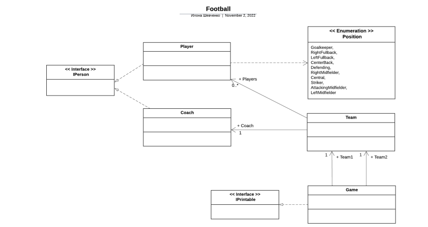

# Project
# Опис предметної області: Кафе

## Перелічення (Enum):
- **DrinkType** – перелік типів напоїв (кава, чай, сік, вода, лимонад)
- **DishType** – перелік типів страв (гарячі страви, холодні страви, салати, десерти, закуски)

## Класи:
- **Menu** – клас для зберігання списку страв та напоїв, які можна замовити.
- **Order** – клас для створення замовлення, що включає список страв і напоїв, а також статус замовлення.
- **Dish** – клас для кожної страви з назвами, описами та цінами.
- **Drink** – клас для кожного напою з назвами, описами та цінами.
- **Customer** – клас, що представляє клієнта кафе, який робить замовлення.
- **Waiter** – клас для офіціанта, який обробляє замовлення.

## Інтерфейси:
- **IOrderable** – інтерфейс, який реалізують класи Dish та Drink, що дозволяє додавати їх до замовлення.
- **IPrintable** – інтерфейс для друку меню або чека замовлення.

## Виявлення та визначення класів і зв'язків
- **Асоціація**: Клас Customer має асоціацію з класом Order (клієнт може мати багато замовлень).
- **Агрегація**: Клас Menu агрегує класи Dish та Drink (меню містить страви та напої, але не є їх власником).
- **Композиція**: Клас Order містить страви та напої, що є частинами замовлення.
- **Реалізація**: Клас Dish і клас Drink реалізують інтерфейс IOrderable.

